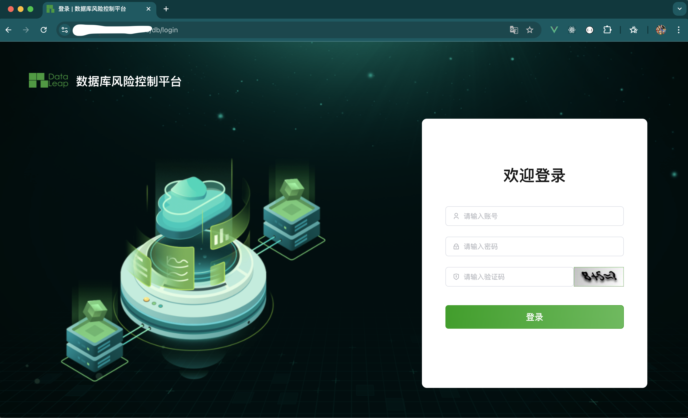

# 在线安装

安装所需环境，参考 [环境要求](./install_environment)

## 1. 安装部署

### 安装包

```bash
# 默认安装路径 /opt
$ cd /opt
$ wget https://github.com/dataleapinfo/smartdb-installer/releases/download/v1.1.0-ce/smartdb-installer-v1.1.0-ce.tar
$ tar -xvf smartdb-installer-v1.1.0-ce.tar 
$ cd smartdb-installer-v1.1.0-ce
```

### 配置文件

```bash
# 安装包提供了默认的环境变量配置文件 `example.env`。如果需要自定义配置，请自行修改。
vi example.env
```

```bash
# SmartDB installation configuration file example.
#
# If you don't understand the prupose, you can skip modify this file.
# the system will automatically fill in Complete parameter documentation
# https://docs.dataleapinfo.com/smartdb/v1/guide/env
#

################# HTTP Configuration ###########################
# 
# The sevice port provided to the outside
#
HTTP_PORT=80

################# HTTPS Configuration ###########################
# 
# The sevice port provided to the outside
#
HTTPS_PORT=443

################# Installation Configuration ###########################
# 
# SmartDB database persistence directory
#
VOLUME_DIR=/opt/smartdb
USE_IPV6=0
DOCKER_SUBNET_IPV6=fc00:1010:1111:200::/64

################# Database Configuration ###########################
# 
# For external database, you need to fill in the external database connection information.
# The system will automatically handle the build-in database.
#
DB_ENGINE=mysql
DB_HOST=mysql
DB_PORT=3306
DB_USER=smartdb
DB_PASSWORD=
DB_NAME=smartdata

################# Redis Configuration ###########################
# 
# For external Redis, you need to fill in the external database connection information.
# The system will automatically handle the build-in database.
#
REDIS_HOST=redis
REDIS_PORT=6379
REDIS_PASSWORD=

# If you are using external Redis Sentinel, please manually fill in the following parameters
#
# REDIS_TYPE=sentinel
# REDIS_NAME=mymaster
# REDIS_SENTINELS=[{"host":"192.168.3.7","port":27001},{"host":"192.168.3.7","port":27002},{"host":"192.168.3.7","port":27003}]
# REDIS_DB=0
#

################# Other Configuration ###########################
TZ=Asia/Shanghai
TIMEZONE=Asia/Shanghai# SmartDB installation configuration file example.
#
# If you don't understand the prupose, you can skip modify this file.
# the system will automatically fill in Complete parameter documentation
# https://docs.dataleapinfo.com/smartdb/v1/guide/env
#

################# HTTP Configuration ###########################
# 
# The sevice port provided to the outside
#
HTTP_PORT=80

################# HTTPS Configuration ###########################
# 
# The sevice port provided to the outside
#
HTTPS_PORT=443

################# Installation Configuration ###########################
# 
# SmartDB database persistence directory
#
VOLUME_DIR=/opt/smartdb
USE_IPV6=0
DOCKER_SUBNET_IPV6=fc00:1010:1111:200::/64

################# Database Configuration ###########################
# 
# For external database, you need to fill in the external database connection information.
# The system will automatically handle the build-in database.
#
DB_ENGINE=mysql
DB_HOST=mysql
DB_PORT=3306
DB_USER=smartdb
DB_PASSWORD=
DB_NAME=smartdata

################# Redis Configuration ###########################
# 
# For external Redis, you need to fill in the external database connection information.
# The system will automatically handle the build-in database.
#
REDIS_HOST=redis
REDIS_PORT=6379
REDIS_PASSWORD=

# If you are using external Redis Sentinel, please manually fill in the following parameters
#
# REDIS_TYPE=sentinel
# REDIS_NAME=mymaster
# REDIS_SENTINELS=[{"host":"192.168.3.7","port":27001},{"host":"192.168.3.7","port":27002},{"host":"192.168.3.7","port":27003}]
# REDIS_DB=0
#

################# Other Configuration ###########################
TZ=Asia/Shanghai
TIMEZONE=Asia/Shanghai
```

 `global.env` 文件指定了默认配置文件的路径，可根据需要自行修改。

```env
# Component version
export VERSION=

# Config variable
export GLOBAL_CONFIG_DIR=/opt/smartdb/config
```

### 执行安装

安装过程分为三个主要步骤：

安装基础环境

```bash
./smartdbcli.sh install
```

初始化数据库

```bash
./smartdbcli.sh init_db
```

启动应用

```bash
./smartdbcli.sh start
```

安装完成后，配置文件路径 /opt/smartdb/conofig

### 管理命令

安装完成后，可以查看系统提供的命令管理 SmartDB。

```bash
./smartdbcli.sh -h
```

## 2. 访问

安装成功，通过浏览器访问

```md
https://<ip>:<port>/db
admin / admin 
第一次登录请修改密码。
```


