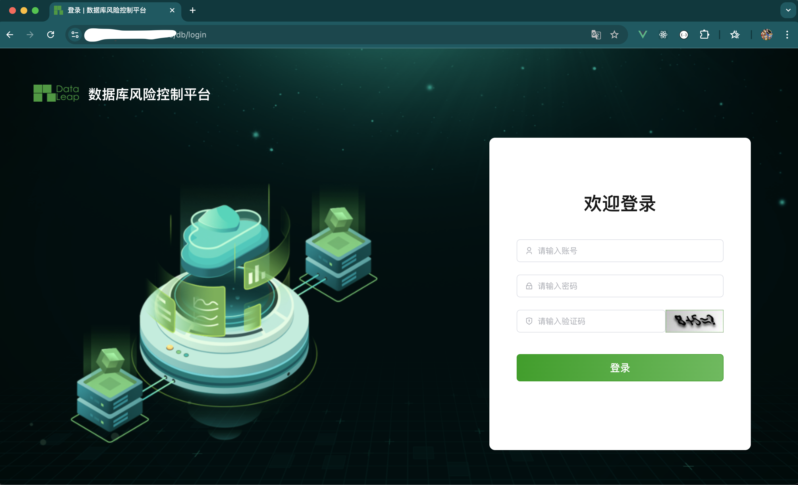

# Online Installation

For required environment setup, please refer to [Environment Requirements](./install_environment)

## 1. Installation and Deployment

### Installation Package

```bash
# Default installation path /opt
$ cd /opt
$ wget https://github.com/dataleapinfo/smartdb-installer/releases/download/v1.1.0-ce/smartdb-installer-v1.1.0-ce.tar
$ tar -xvf smartdb-installer-v1.1.0-ce.tar 
$ cd smartdb-installer-v1.1.0-ce
```

### Configuration File

```bash
# The installation package provides a default environment variable configuration file `example.env`. If you need custom configuration, please modify it as needed.
vi example.env
```

```bash
# SmartDB installation configuration file example.
#
# If you don't understand the purpose, you can skip modifying this file.
# The system will automatically fill in the parameters. Complete parameter documentation
# https://docs.dataleapinfo.com/smartdb/v1/guide/env
#

################# HTTP Configuration ###########################
# 
# The service port provided to the outside
#
HTTP_PORT=80

################# HTTPS Configuration ###########################
# 
# The service port provided to the outside
#
HTTPS_PORT=443

################# Installation Configuration ###########################
# 
# SmartDB database persistence directory
#
VOLUME_DIR=/opt/smartdb
USE_IPV6=0
DOCKER_SUBNET_IPV6=fc00:1010:1111:200::/64

################# Database Configuration ###########################
# 
# For external database, you need to fill in the external database connection information.
# The system will automatically handle the built-in database.
#
DB_ENGINE=mysql
DB_HOST=mysql
DB_PORT=3306
DB_USER=smartdb
DB_PASSWORD=
DB_NAME=smartdata

################# Redis Configuration ###########################
# 
# For external Redis, you need to fill in the external database connection information.
# The system will automatically handle the built-in database.
#
REDIS_HOST=redis
REDIS_PORT=6379
REDIS_PASSWORD=

# If you are using external Redis Sentinel, please manually fill in the following parameters
#
# REDIS_TYPE=sentinel
# REDIS_NAME=mymaster
# REDIS_SENTINELS=[{"host":"192.168.3.7","port":27001},{"host":"192.168.3.7","port":27002},{"host":"192.168.3.7","port":27003}]
# REDIS_DB=0
#

################# Other Configuration ###########################
TZ=Asia/Shanghai
TIMEZONE=Asia/Shanghai
```

The `global.env` file specifies the default configuration file path and can be modified as needed.

```env
# Component version
export VERSION=

# Config variable
export GLOBAL_CONFIG_DIR=/opt/smartdb/config
```

### Execute Installation

The installation process consists of three main steps:

1. Install basic environment:
```bash
./smartdbcli.sh install
```

2. Initialize database:
```bash
./smartdbcli.sh init_db
```

3. Start application:
```bash
./smartdbcli.sh start
```

After installation, the configuration file path is `/opt/smartdb/config`

### Management Commands

After installation, you can use the system-provided commands to manage SmartDB.

```bash
./smartdbcli.sh -h
```

## 2. Access

After successful installation, access through your browser:

```md
https://<ip>:<port>/db
admin / admin 
Please change the password on first login.
```

 